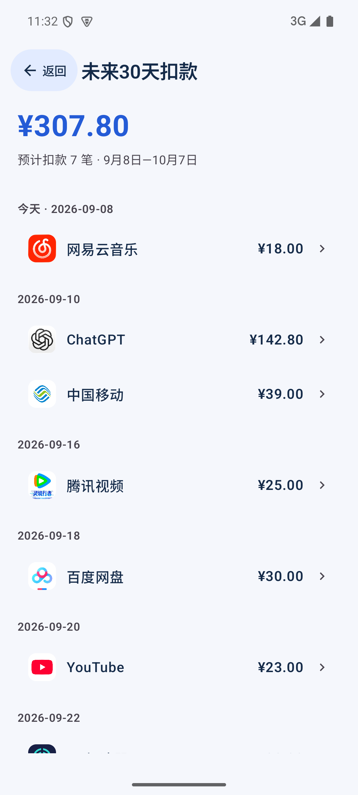
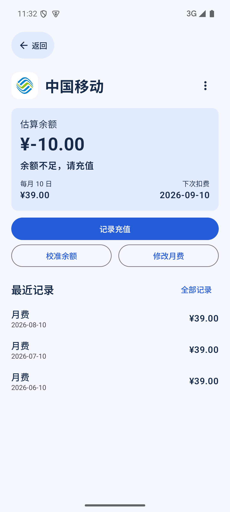
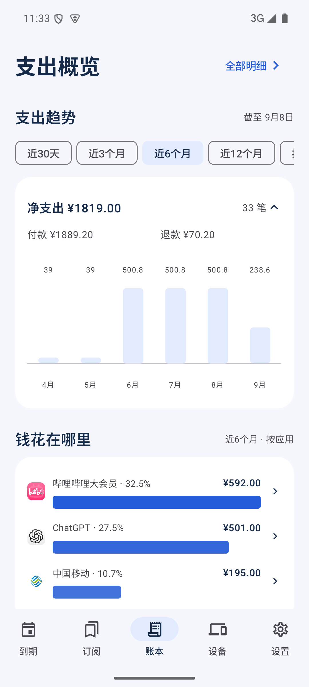

# RenewBoard · 订阅簿

本机优先的中文 Android 订阅管理应用，Android 8.0+。把套餐付款、会员权益和到期日分开管理，也记录个人设备的服役状态。

## 界面

下图为 1.6.0 模拟器中的演示数据；首次安装默认为空账本。

  

## 可以做什么

- 62 项常见会员与自定义分类快捷选择，支持搜索和最近使用快捷选择；官方应用商店/官网图标，无需网络加载。
- 新增、编辑、归档、删除订阅；列表支持搜索、自动续费筛选与排序，过期项目默认收起。删除后真实付款仍保留在账本。
- 日期选择有独立的年份、月份入口，月份可直接点选，也可逐月切换或回到今天；支持大字体，保留手动输入。金额使用数字键盘，币种通过列表选择。新增先选会员或自定义；保存按钮固定在底部，备注和联合权益默认收起，付款进入独立页面。
- 周、月、年及整数倍周期；自动续费与一次性 / 手动续费。订阅、付款、退款与设备表单支持本机草稿，返回时可保留或放弃，保存成功后清除草稿。
- 原始扣款日期作为周期锚点，月末与闰年不逐月漂移。默认权益随扣款日期和周期联动，手动修改后独立计算，可恢复跟随。
- 话费余额账户：当前余额、固定月费与扣费日推算剩余余额和充值提醒；月费计入未来30天预计扣款，打开应用时按设定扣费日补记余额查询日期之后的月费支出；充值保留记录、只增加余额、不重复计支出。支持历史充值补记，明确选择是否已包含在余额中；余额校准可将减少的差额记作额外扣费。转换已有话费订阅时保留历史付款；详情仅展示最近三笔，点击记录查看详情，通过“全部记录”进入独立历史页面。
- 提前续费从原到期日延长，可一次续多期并预览到期日，显示本次实付总额和实际续费时长，未手动填写时按期数合计，手动输入优惠价后保留该金额；过期权益可选从付款日重新开通或补交原周期账单，保存前预览到期日与下次扣款。仅记账和付款更正不改变权益。赠送时长不生成付款。同一订阅、日期和金额相同时提示检查，确认后仍可记账。
- 联合套餐一笔付款对应多项权益，权益分别到期，套餐价格只统计一次。
- 紧凑蓝色首页突出最近到期与未来30天人民币预计总额，点击总额按日期查看扣款构成，笔数按预计扣款次数统计；需充值的话费优先显示，健康余额放在到期事项之后，外币预计按该订阅最近一次付款的实际折算比例计算，缺少依据时仍显示其余已知人民币总额，并列出待补录订阅。
- 账本以统计概览为首页，显示净支出，可展开查看付款与退款构成；七档支出趋势（近30天/3个月/6个月/12个月/按年/5年/全部）、应用支出排行和付款明细。点击趋势柱仅更新应用排行，明细入口跟随所选时段；点击应用排行可查看该应用在所选时段的付款。明细为独立页面，按日期分组。未补录的外币金额单独提示。
- 明细支持搜索、订阅付款/退款/话费扣费/话费充值/已删订阅筛选、单笔及批量删除；删除订阅时可选择是否同时删除付款。仅删除付款不会撤销权益或改变话费余额。
- 付款详情的更多菜单可记录全部或部分退款，关联原付款并按退款日期冲减支出；退款不改变权益或话费余额，原付款与关联退款支持双向查看。删除原付款会一并删除关联退款，确认前显示数量。外币退款填写实际人民币到账金额。
- 外币首次付款与续费填写付款当天的人民币实付金额，保存后冻结，后续汇率变化不改历史。旧外币记录显示待补录，可按当日账单补齐；不按当前汇率倒算。
- 16 类常用设备通过带图标的紧凑网格选择，支持搜索；包含鼠标、椅子、耳机、显示屏、手表、键盘、手柄、电纸书等。
- 设备列表默认服役中，通过下拉查看已退役、已卖出和待购买；列表金额明确区分购入金额、已卖出净花费与待购买预算；记录金额、服役日期和备注，退役记录退役日期，卖出记录卖出日期与金额；停止服役早于卖出时展开独立日期，服役时长按停止服役日期冻结。查看服役天数及日均购入成本，已卖出突出扣除卖价后的净花费。支持搜索名称、类别和按服役日期、金额、服役天数排序。设备金额单独管理，不自动加入订阅支出。
- 设置首页按功能分组；到期提醒、本地备份、坚果云 WebDAV、更新与关于分别进入独立页面。
- 默认提前3天及当天提醒，可用快捷选项及自定义天数调整；通知直接打开对应订阅，支持确认扣款或明天提醒。续费、充值或校准后清理已解决事项的旧提醒；过去7天错过的提醒合并补发一次。关闭自动续费仍保留到期提醒；设置显示真实通知权限与最近备份结果。遵守系统通知授权、省电与 WorkManager 调度，不保证分钟级提醒。
- 设置的“更新与关于”显示作者 RongGuang233，支持手动检查 GitHub 最新正式版本；应用内下载并显示进度，下载完成后唤起系统安装界面。首次需允许订阅簿安装应用，最终覆盖安装由用户确认；下载仍需能连接 GitHub。
- JSON 文件导出 / 恢复；1.6.0可读取旧备份，包含退款和独立卖出日期的新备份请在1.5.0及更新版本恢复。未完成草稿仅保留本机，不包含在账本备份中。坚果云 WebDAV 自动与手动备份。恢复先预览时间、数量，再确认整体替换。

普通订阅的预计扣款不会自动变为付款记录，请实际扣款后选择“记录付款 / 提前续费”。话费采用按月记账：按已设置月费补记，金额并非从运营商获取；余额查询日期之前的历史不倒推，修改月费可选立即、下月或直接选择年月生效，先按旧规则结算，后续按新规则扣费，不重算已记账记录。充值在明细中单列、不计支出。没有支付处理、多设备合并或网页同步。

## WebDAV

在“设置 → 坚果云 · WebDAV”中输入 `https://dav.jianguoyun.com/dav/`、账号和坚果云专用应用密码。保存后在线合并变更自动备份，也可点击立即备份。未配置时不上传数据。

- 仅使用远端 `RenewBoard/` 专用目录。
- 上传临时文件 → 下载核验 → MOVE 发布。仅成功自动备份进入最近10份保留范围；手动备份不自动删除。
- 备份包含账本、套餐、权益、付款（含已冻结人民币金额）、设备、提醒与已有汇率设置，排除账号和密码。
- 密码由 Android Keystore 加密保存在本机，不写日志或导出。
- 云端 JSON 为明文业务备份，经 HTTPS 传输。使用自己的可信 WebDAV 服务。
- 损坏、缺字段、不支持版本或下载失败时不替换本机账本。
- 系统可能延迟后台任务；设置中可看最后成功时间及错误。断开仅清除本机连接，不删除远端备份。

## 构建

JDK 17、Android SDK platform 35 / build-tools 35.0.0，项目自带 Gradle 8.11.1 wrapper。

```sh
export JAVA_HOME=/path/to/jdk17
export ANDROID_HOME=/path/to/android/sdk
./gradlew testDebugUnitTest assembleDebug assembleDebugAndroidTest
ANDROID_SERIAL=emulator-5554 scripts/test-device.sh
```

源码中禁用了 Gradle 隐式 SDK 下载，先通过官方 SDK 工具安装所需组件。本机共用环境路径另见未纳入发布的 `docs/android-environment.md`。

release 签名：

```sh
python3 scripts/create-release-key.py
./gradlew assembleRelease -PsigningProperties="$HOME/Library/Application Support/RenewBoard/signing/signing.properties"
```

该脚本在 macOS 用户应用支持目录创建受限签名文件，重复运行保留已有密钥。不要发布密钥、密码文件、signing.properties 或 local.properties。无签名参数的 release 构建不会冒用 debug 密钥。

测试在独立 debug 包 / 测试数据库执行；设备脚本面向API33+，先运行通知拒绝等测试，再单独运行授权通知测试，最后撤销debug通知权限。正式应用包名 `cn.renewboard`，debug 为 `cn.renewboard.debug`。

## 许可证与隐私

原创代码 MIT；第三方组件保留各自许可证，App 设置中可离线阅读。

- [第三方许可证与兼容性](docs/licenses.md)
- [隐私说明](docs/privacy.md)
- [验收结果](docs/acceptance.md)

产品思路参考[有数鸟开发者2020年历史介绍](https://meta.appinn.net/t/topic/15300)中的快捷录入、到期汇总与费用统计，未声称当前 App 实测，未复制品牌或付费资源。

1.1.0 界面参考 [Suby 订阅列表](https://subyapp.com/features/subscriptions) 的服务目录与到期信息层级，以及 [Subby 设计案例](https://www.mattpercy.com/subby) 的图标识别与次要信息精简。具体应用使用官方应用商店或官网图标，来源见 [图标来源](preview/icons/sources.md)；未指定应用的自定义分类保留 Material 图形。图标不表示与对应品牌有关联。
