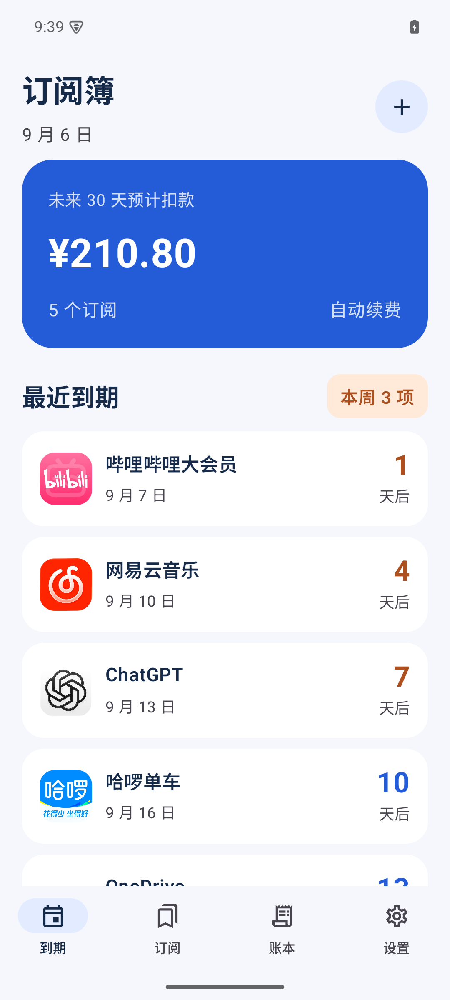
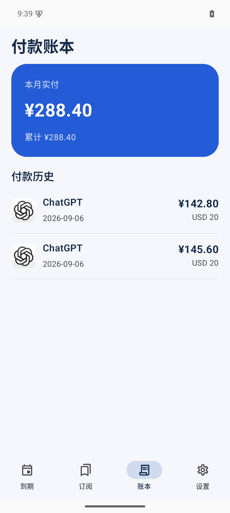

# RenewBoard · 订阅簿

本机优先的中文 Android 订阅管理应用，Android 8.0+。把套餐付款、会员权益和到期日分开管理。

## 界面

下图为 1.1.0 测试版模拟器中的演示数据；安装后默认为空账本。

 

## 可以做什么

- 62 项常见会员与自定义分类快捷选择，支持搜索；官方应用商店/官网图标，无需网络加载。
- 新增、编辑、归档、删除订阅；删除后真实付款仍保留在账本。
- 周、月、年及整数倍周期；自动续费与一次性 / 手动续费。
- 原始扣款日期作为周期锚点，月末与闰年不逐月漂移。
- 提前续费从原到期日延长；过期权益从付款日重新开始。赠送时长不生成付款。
- 联合套餐一笔付款对应多项权益，权益分别到期，套餐价格只统计一次。
- 蓝色首页突出最近到期与未来30天人民币预计总额，外币预计按该订阅最近一次付款的实际折算比例计算，缺少依据时提示补录；账本突出本月/累计人民币实付。
- 外币首次付款与续费填写付款当天的人民币实付金额，保存后冻结，后续汇率变化不改历史。旧外币记录显示待补录，可按当日账单补齐；不按当前汇率倒算。
- 默认提前3天及当天提醒，可设置或关闭。遵守系统通知授权、省电与 WorkManager 调度，不保证分钟级提醒。
- 设置页支持手动检查 GitHub 最新正式版本；应用内下载并显示进度，下载完成后唤起系统安装界面。首次需允许订阅簿安装应用，最终覆盖安装由用户确认；下载仍需能连接 GitHub。
- JSON 文件导出 / 恢复；坚果云 WebDAV 自动与手动备份。恢复先预览时间、数量，再确认整体替换。

预计扣款不会自动变为真实付款。请实际扣款后在订阅详情选择“记录付款 / 提前续费”。没有支付处理、多设备合并或网页同步。

## WebDAV

设置中输入 `https://dav.jianguoyun.com/dav/`、账号和坚果云专用应用密码。保存后在线合并变更自动备份，也可点击立即备份。未配置时不上传数据。

- 仅使用远端 `RenewBoard/` 专用目录。
- 上传临时文件 → 下载核验 → MOVE 发布。仅成功自动备份进入最近10份保留范围；手动备份不自动删除。
- 备份包含账本、套餐、权益、付款（含已冻结人民币金额）、提醒与已有汇率设置，排除账号和密码。
- 密码由 Android Keystore 加密保存在本机，不写日志或导出。
- 云端 JSON 为明文业务备份，经 HTTPS 传输。使用自己的可信 WebDAV 服务。
- 损坏、缺字段、不支持版本或下载失败时不替换本机账本。
- 系统可能延迟后台任务；设置中可看最后成功时间及错误。断开仅清除本机连接，不删除远端备份。

## 构建

JDK 17、Android SDK platform 35 / build-tools 35.0.0，项目自带 Gradle 8.11.1 wrapper。

```sh
export JAVA_HOME=/path/to/jdk17
export ANDROID_HOME=/path/to/android/sdk
./gradlew testDebugUnitTest assembleDebug assembleDebugAndroidTest
ANDROID_SERIAL=emulator-5554 scripts/test-device.sh
```

源码中禁用了 Gradle 隐式 SDK 下载，先通过官方 SDK 工具安装所需组件。本机共用环境路径另见未纳入发布的 `docs/android-environment.md`。

release 签名：

```sh
python3 scripts/create-release-key.py
./gradlew assembleRelease -PsigningProperties="$HOME/Library/Application Support/RenewBoard/signing/signing.properties"
```

该脚本在 macOS 用户应用支持目录创建受限签名文件，重复运行保留已有密钥。不要发布密钥、密码文件、signing.properties 或 local.properties。无签名参数的 release 构建不会冒用 debug 密钥。

测试在独立 debug 包 / 测试数据库执行；设备脚本面向API33+，先运行通知拒绝等测试，再单独运行授权通知测试，最后撤销debug通知权限。正式应用包名 `cn.renewboard`，debug 为 `cn.renewboard.debug`。

## 许可证与隐私

原创代码 MIT；第三方组件保留各自许可证，App 设置中可离线阅读。

- [第三方许可证与兼容性](docs/licenses.md)
- [隐私说明](docs/privacy.md)
- [验收结果](docs/acceptance.md)

产品思路参考[有数鸟开发者2020年历史介绍](https://meta.appinn.net/t/topic/15300)中的快捷录入、到期汇总与费用统计，未声称当前 App 实测，未复制品牌或付费资源。

1.1.0 界面参考 [Suby 订阅列表](https://subyapp.com/features/subscriptions) 的服务目录与到期信息层级，以及 [Subby 设计案例](https://www.mattpercy.com/subby) 的图标识别与次要信息精简。具体应用使用官方应用商店或官网图标，来源见 [图标来源](preview/icons/sources.md)；未指定应用的自定义分类保留 Material 图形。图标不表示与对应品牌有关联。
